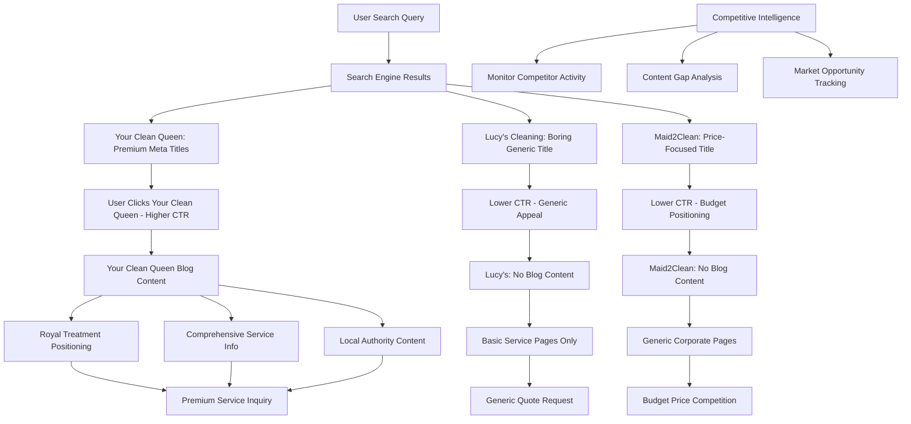

# Design Document

## Overview

This design outlines a comprehensive SEO domination system for Your Clean Queen that will exploit competitor weaknesses and establish market leadership in Dorchester. Based on competitive analysis of Lucy's Cleaning Services and Maid2Clean, this system will improve click-through rates from 0% CTR to 5-8% CTR (above industry standard) by leveraging the complete content marketing vacuum left by competitors.

## **Competitive Advantage Strategy:**

### **Market Opportunity Analysis:**
- **Lucy's Cleaning**: NO BLOG, weak meta optimization ("Lucy's Cleaning Services Dorchester"), generic positioning
- **Maid2Clean**: NO CONTENT MARKETING, price-focused (£17.48/hour), corporate franchise feel
- **Market Gap**: ZERO cleaning companies in Dorchester have content marketing strategies

### **Our Domination Plan:**
1. **Content Monopoly** - Be the ONLY cleaning company with a comprehensive blog
2. **Premium Meta Optimization** - Compelling titles vs competitors' boring formats
3. **Service Gap Exploitation** - Target missed opportunities (end of tenancy, premium services)
4. **Local Authority Building** - Comprehensive area coverage competitors ignore
5. **Premium Brand Positioning** - "Royal Treatment" vs budget/generic competitors

The design leverages your existing Next.js 15 architecture while adding competitive intelligence and market domination capabilities.

## Architecture

### Competitive Domination Architecture



### Technical Stack Integration

**Existing Stack (Maintained):**
- Next.js 15 with App Router
- TypeScript
- Tailwind CSS
- React 19
- Current SEO utilities (`seo-constants.ts`, `seo-utils.ts`)

**New Components (Added):**
- Blog management system
- Content generation utilities
- Enhanced schema generators
- Analytics integration
- Meta optimization engine

## Components and Interfaces

### 1. Headless CMS Integration

#### Recommended CMS Options
- **Contentful** - Easy to use, great SEO features, free tier available
- **Strapi** - Open source, self-hosted option
- **Sanity** - Developer-friendly, real-time collaboration
- **Ghost** - Built for blogging, excellent SEO out of the box

#### API Integration Structure
```typescript
// Simple API client for CMS
interface CMSClient {
  getPosts(limit?: number, category?: string): Promise<BlogPost[]>
  getPost(slug: string): Promise<BlogPost>
  getCategories(): Promise<Category[]>
}

interface BlogPost {
  id: string
  slug: string
  title: string
  content: string
  excerpt: string
  publishedAt: string
  categories: string[]
  seoTitle: string
  seoDescription: string
  featuredImage?: string
}
```

#### Simple Blog Structure
```
src/app/blog/
├── page.tsx                 # Blog listing (fetches from CMS API)
└── [slug]/
    └── page.tsx            # Individual blog post (fetches from CMS API)
```

### 2. CMS Content Management

#### Content Creation Workflow
1. **Create content in CMS** - Use CMS interface to write blog posts
2. **Auto-generate SEO fields** - CMS plugins handle meta titles/descriptions
3. **API fetch on build** - Next.js fetches content at build time
4. **Static generation** - Blog pages generated as static HTML for speed

#### CMS Configuration
```typescript
// Example Contentful/Strapi content model
interface BlogContentModel {
  title: string
  slug: string
  content: RichText
  excerpt: string
  category: Reference<Category>
  seoTitle: string
  seoDescription: string
  targetKeywords: string[]
  publishedDate: Date
  featuredImage: Asset
}
```

### 3. Enhanced SEO Components

#### Competitive Meta Optimization Engine
```typescript
interface CompetitiveOptimizedMeta {
  title: string
  description: string
  keywords: string[]
  competitorAnalysis: CompetitorMeta[]
  differentiationFactors: string[]
  premiumPositioning: boolean
  openGraph: OpenGraphData
  twitter: TwitterData
  schema: StructuredData[]
  canonical: string
}

interface CompetitorMeta {
  competitor: 'Lucy\'s Cleaning' | 'Maid2Clean'
  title: string
  description: string
  weaknesses: string[]
  opportunities: string[]
}

interface CompetitiveSEOOptimizer {
  generateSuperiorTitle(
    baseTitle: string, 
    keywords: string[], 
    competitorTitles: string[],
    location?: string
  ): string
  
  createCompellingDescription(
    content: string, 
    keywords: string[], 
    competitorDescriptions: string[],
    premiumPositioning: boolean
  ): string
  
  optimizeForCTRSuperiority(
    meta: CompetitiveOptimizedMeta, 
    searchIntent: string,
    competitorMeta: CompetitorMeta[]
  ): CompetitiveOptimizedMeta
  
  // Examples of superior titles vs competitors:
  // Competitor: "Lucy's Cleaning Services Dorchester"
  // Ours: "Professional Cleaners Dorchester | Royal Treatment | Fully Insured & DBS Checked"
  
  // Competitor: "Get an affordable domestic cleaner... £17.48 per hour"
  // Ours: "Premium Cleaning Services Dorchester | Royal Treatment Experience | Free Quote"
}
```

#### Rich Snippets Generator
```typescript
interface RichSnippetGenerator {
  generateServiceSchema(service: ServiceData): StructuredData
  generateFAQSchema(faqs: FAQ[]): StructuredData
  generateReviewSchema(reviews: Review[]): StructuredData
  generateLocalBusinessSchema(location: LocationData): StructuredData
  generateBreadcrumbSchema(breadcrumbs: Breadcrumb[]): StructuredData
}
```

### 4. New Landing Pages Structure

#### Service-Specific Pages
```
src/app/
├── end-of-tenancy-cleaning/
│   ├── page.tsx
│   └── [location]/
│       └── page.tsx        # e.g., /end-of-tenancy-cleaning/dorchester
├── weekly-cleaning/
│   ├── page.tsx
│   └── [location]/
│       └── page.tsx        # e.g., /weekly-cleaning/weymouth
├── deep-cleaning/
│   ├── page.tsx
│   └── [location]/
│       └── page.tsx
└── fortnightly-cleaning/
    ├── page.tsx
    └── [location]/
        └── page.tsx
```

## Data Models

### Blog Post Data Model
```typescript
// Extended from existing structure
export interface BlogPostData {
  // Core content
  id: string
  slug: string
  title: string
  content: string
  excerpt: string
  
  // SEO optimization
  seo: {
    metaTitle: string
    metaDescription: string
    focusKeyword: string
    targetKeywords: string[]
    seoScore: number
    readabilityScore: number
  }
  
  // Categorization
  categories: BlogCategory[]
  tags: string[]
  serviceType: ServiceType
  location?: Location
  
  // Publishing
  status: PostStatus
  publishedAt: Date
  updatedAt: Date
  author: Author
  
  // Performance
  analytics: {
    views: number
    clicks: number
    ctr: number
    conversions: number
    avgTimeOnPage: number
  }
}
```

### SEO Performance Data Model
```typescript
export interface SEOPerformanceData {
  keyword: string
  page: string
  impressions: number
  clicks: number
  ctr: number
  position: number
  date: Date
  
  // Tracking improvements
  previousCTR?: number
  ctrImprovement?: number
  targetCTR: number
  
  // Content optimization
  hasOptimizedMeta: boolean
  hasRichSnippets: boolean
  hasTargetedContent: boolean
}
```

## Error Handling

### SEO Validation System
```typescript
interface SEOValidator {
  validateMetaTitle(title: string): ValidationResult
  validateMetaDescription(description: string): ValidationResult
  validateKeywordDensity(content: string, keywords: string[]): ValidationResult
  validateSchemaMarkup(schema: StructuredData): ValidationResult
  validatePageSpeed(url: string): ValidationResult
}

interface ValidationResult {
  isValid: boolean
  score: number
  warnings: string[]
  errors: string[]
  suggestions: string[]
}
```

### Content Quality Checks
- **Title Optimization**: Length (50-60 chars), keyword placement, emotional triggers
- **Description Optimization**: Length (150-160 chars), CTA inclusion, value proposition
- **Content Quality**: Readability score, keyword density, heading structure
- **Technical SEO**: Schema validation, page speed, mobile-friendliness

## Testing Strategy

### SEO Testing Framework

#### 1. A/B Testing for Meta Optimization
```typescript
interface MetaABTest {
  testId: string
  keyword: string
  variants: {
    control: { title: string; description: string }
    variant: { title: string; description: string }
  }
  metrics: {
    impressions: number
    clicks: number
    ctr: number
  }
  duration: number
  significance: number
}
```

#### 2. Content Performance Testing
- **Blog Post Performance**: Track views, time on page, conversion rates
- **Landing Page Optimization**: Monitor CTR improvements for target keywords
- **Schema Markup Testing**: Verify rich snippets appear in search results

#### 3. Technical SEO Testing
- **Page Speed Testing**: Core Web Vitals monitoring
- **Mobile Optimization**: Mobile-first indexing compliance
- **Schema Validation**: Structured data testing tool integration

### Testing Scenarios

#### High-Priority Test Cases
1. **End of Tenancy Landing Page**: Target "end of tenancy cleaning dorchester" (13 impressions, 0% CTR)
2. **Weekly Cleaning Blog Posts**: Target "weekly cleaning" variations
3. **Meta Title Optimization**: Test emotional triggers vs. descriptive titles
4. **Rich Snippets**: Test FAQ schema vs. service schema impact

#### Success Metrics
- **CTR Improvement**: From 0% to 2-5% for target keywords
- **Impression Growth**: 20% increase in total impressions
- **Conversion Rate**: 15% improvement in organic traffic conversions
- **Keyword Rankings**: Top 10 positions for 10+ target keywords

## Competitive Content Domination Strategy

### Content Categories That Competitors CANNOT Match

#### 1. Service Authority Content (Zero Competition)
- "Complete Guide to End of Tenancy Cleaning in Dorchester" - **Lucy's & Maid2Clean have NO end of tenancy content**
- "Weekly vs. Fortnightly Cleaning: What's Best for Your Home?" - **Competitors offer no guidance**
- "Deep Cleaning Checklist for West Dorset Homes" - **No competitor provides cleaning guides**
- "Professional Cleaning vs. DIY: Cost Comparison" - **Competitors avoid this topic**
- "Royal Treatment Cleaning: What Makes Us Different" - **Unique positioning competitors cannot copy**

#### 2. Local Authority Content (Competitors Ignore)
- "Why Dorchester Homes Need Professional Cleaning" - **Lucy's has basic local mention only**
- "Coastal Property Cleaning Tips for Weymouth Residents" - **Maid2Clean mentions Weymouth but no specific content**
- "Cleaning Challenges in Period Properties (West Dorset Focus)" - **No competitor addresses this**
- "Best Cleaning Schedule for Busy Poundbury Families" - **Competitors ignore micro-local areas**
- "Dorchester vs. Weymouth: Different Cleaning Needs" - **Comparative local content**

#### 3. Premium Positioning Content (Differentiates from Budget Competitors)
- "Why Choose Premium Cleaning Over Budget Services" - **Directly addresses Maid2Clean's £17.48/hour positioning**
- "The Royal Treatment Difference: Quality Over Quantity" - **Unique brand positioning**
- "What to Expect from Professional DBS-Checked Cleaners" - **Trust factors competitors don't emphasize**
- "Investment in Quality: Long-term Benefits of Premium Cleaning" - **Justifies higher prices**

#### 4. Service Gap Exploitation Content
- "End of Tenancy Cleaning: Get Your Sparkling resultsd" - **13 monthly searches, zero competitor content**
- "Holiday Home Cleaning in West Dorset: Seasonal Challenges" - **Local opportunity competitors miss**
- "Moving House Cleaning Checklist for Dorchester Residents" - **Practical guides competitors don't provide**
- "Post-Construction Cleaning: Specialized Services" - **Niche service opportunity**

### SEO Content Optimization

#### Keyword Integration Strategy
- **Primary Keywords**: Naturally integrated in H1, first paragraph, conclusion
- **Secondary Keywords**: Distributed throughout content with 1-2% density
- **Long-tail Keywords**: Used in subheadings and FAQ sections
- **Local Keywords**: Integrated with location-specific information

#### Content Structure Template
```markdown
# [Primary Keyword] - [Location] | Your Clean Queen

## Introduction (150-200 words)
- Hook with local relevance
- Primary keyword in first 100 words
- Clear value proposition

## Main Content Sections (H2)
### [Secondary Keyword] Section
### [Service-specific] Information
### [Location-specific] Details

## FAQ Section (H2)
- Target question-based keywords
- Schema markup for rich snippets

## Call-to-Action Section
- Local phone number
- Service area emphasis
- Free quote offer

## Conclusion
- Reinforce primary keyword
- Local business emphasis
- Next steps for readers
```

## Competitive Intelligence & Market Domination

### Competitor Monitoring System

#### Real-time Competitive Analysis
```typescript
interface CompetitorMonitoring {
  competitors: {
    'lucys-cleaning': {
      domain: string
      hasNewContent: boolean
      metaTitleChanges: string[]
      newPages: string[]
      blogLaunched: boolean
      lastChecked: Date
    }
    'maid2clean': {
      domain: string
      hasNewContent: boolean
      metaTitleChanges: string[]
      newPages: string[]
      blogLaunched: boolean
      lastChecked: Date
    }
  }
  
  alerts: {
    competitorBlogLaunch: boolean
    competitorContentCopy: boolean
    newCompetitorPages: string[]
    metaTitleCompetition: boolean
  }
}
```

### Market Domination Tactics

#### 1. First-Mover Advantage Protection
- **Content Depth**: Create comprehensive guides competitors cannot easily match
- **Local Authority**: Establish expertise in Dorchester/West Dorset cleaning
- **Premium Positioning**: Own the quality market segment
- **SEO Moats**: Build strong backlink profiles and domain authority

#### 2. Competitive Response Strategy
```typescript
interface CompetitiveResponse {
  // If Lucy's Cleaning launches a blog
  lucysBlogResponse: {
    action: 'accelerate-content-production'
    tactics: ['publish-superior-guides', 'target-their-missed-keywords', 'enhance-local-content']
  }
  
  // If Maid2Clean improves meta titles
  maid2cleanMetaResponse: {
    action: 'enhance-premium-positioning'
    tactics: ['emphasize-royal-treatment', 'highlight-quality-differences', 'target-premium-keywords']
  }
  
  // If new competitor enters market
  newCompetitorResponse: {
    action: 'content-authority-defense'
    tactics: ['publish-comprehensive-guides', 'increase-local-content', 'enhance-service-differentiation']
  }
}
```

#### 3. Market Share Capture Strategy

**Phase 1: Content Monopoly (Months 1-3)**
- Launch comprehensive blog while competitors have zero content
- Target all missed keyword opportunities
- Establish local cleaning authority

**Phase 2: Premium Positioning (Months 4-6)**
- Differentiate from budget competitors through quality content
- Build trust through expertise and professionalism
- Capture high-value customer segment

**Phase 3: Market Defense (Months 7+)**
- Monitor competitor responses
- Maintain content quality and depth advantage
- Expand into new service areas and locations

### Success Metrics vs Competitors

#### Competitive KPIs
```typescript
interface CompetitiveKPIs {
  marketShare: {
    organicTrafficShare: number // % of total cleaning searches in Dorchester
    keywordRankingSuperiority: number // Keywords where we outrank competitors
    contentGapAdvantage: number // Topics we cover that competitors don't
  }
  
  brandPositioning: {
    premiumMarketCapture: number // % of high-value searches
    brandSearchVolume: number // "Your Clean Queen" vs competitor brand searches
    qualityPerception: number // Review scores vs competitors
  }
  
  competitiveAdvantage: {
    contentVolumeAdvantage: number // Blog posts vs competitors (currently infinite)
    metaOptimizationSuperiority: number // CTR vs competitors
    localAuthorityScore: number // Local content depth vs competitors
  }
}
```

This design provides a comprehensive framework for not just improving SEO performance, but specifically dominating the Dorchester cleaning market by exploiting competitor weaknesses and maintaining sustainable competitive advantages.